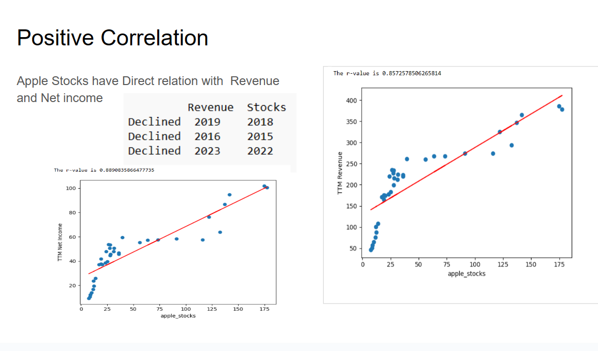
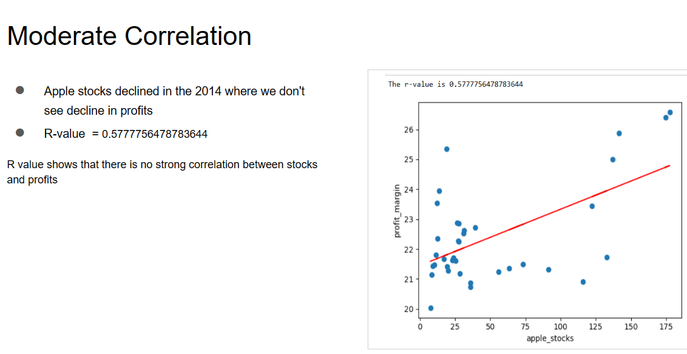
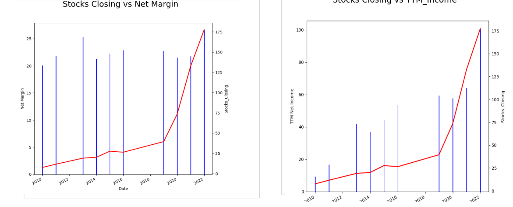

# Project1G1
Analysis on Appple stocks Vs Income  and Revenue
Profit Margin Vs  Apple Stocks Vs Revenue 

Apple revenue increased dramatically in the 2010s, from $65 billion at the start of the decade to $274 billion by the end. Revenues declined in 2022.
Apple stocks declined in the 2015 where we don't see decline  profits

Correlation:

Apple Profit margin seems to be constant over the years
Apple TTM Income and revenue has increased drastically over the years which is directly related to stocks 
